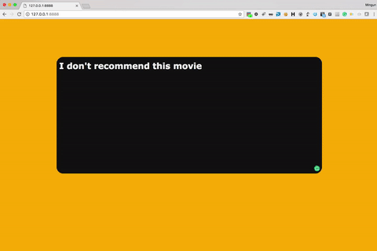

# Sentiment Analysis project with imdb

The goal of this project is to analys your sentiment through the review typed on the page.
If the background turns into green, that means you have the positive review. Red is the opposite.

## Getting Started

Demo server is based on Flask. To run the server, execute demo_server.py
```python
python demo_server.py
```

Next, once you go to the root page of your server, you will get the simple page.
You can just type the review of what you watched recently for the test.

|  |  |
|:---:|:---:|
             

### Prerequisites

This open source is based on Python 3.5

```
pip install -r requirement.txt
```

### Training


```python
if __name__ == "__main__":
	manager = Manager(ngram_range=2)
    manager.load_dataset()
    model = CNNModel().build(embedding_matrix=manager.embedding_matrix,
                             max_features=manager.max_features).model
    manager.train(model)
    manager.store_model("cnn_and_bi-gram")
```

To train a model, go to `manager.py`, and then we need to set up some parameters.
An n-gram is a contiguous sequence of n items from a given sequence of text. You can set the range through `ngram_range` From my experience, I recommend you to use bi-gram, ngram_range=2. `embedding_matrix` means pre-trained matrix. Some model doesn't use this parameter. In that case, you need to remove that parameter. You don't need to consider `max_features` Lastly, your trained-model will be stored by the parameter of `store.model` method. In this example, `cnn_and_bi-gram` will be your filename.

### Using my model

```python
if __name__ == '__main__':
    movie_review_classifier = Classifier(filename="single_84.588acc_model")
    movie_review_classifier.build()

    app.run(
        host="0.0.0.0",
        port=int("8888")
    )
```

Once you trained, you would get your own model. In this example, I will use the simple model that has 84.588 accuracy. Go to `demo_server.py` and set up your model. Make sure you should take off the file extension. That's all. Run it!!:)

## Running the tests

Coming soon.


## Contributing

Welcome!


## Authors

* **James Pak**


## License

This project is licensed under Gridspace.

## Acknowledgments

* Word embedding
* DNNs
